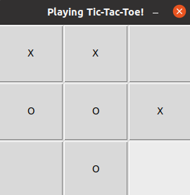
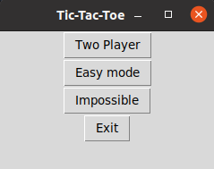
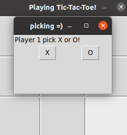

Quick preview:

The goal of this project was to use the tkinter python frame work to implement the minimax algorithm to create an unbeatable tictactoe game.
I also implemented a two player version to play with a friend. I also added the option to play against an easy bot.

To Run:
  -python 3 is required to be downloaded and installed on your machine
  -go to directory where the code is and type:
      python3 main.py
_______________________________________________
Start Screen:

_______________________________________________
Picking X or O as your icon:

