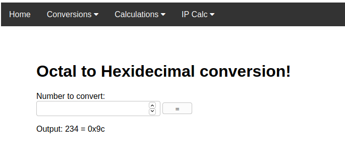

the goal of this project was to practice with bit manipulation as well as getting a better grasp of how the django framework operates.

To run:
  -download the code

  -go to the directory that the project is in
    type:
      $python manage.py runserver

  -open web browser and go to url:
      http://127.0.0.1:8000

Here's a quick look at how the basic website looks:

